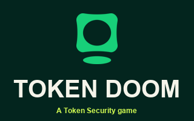
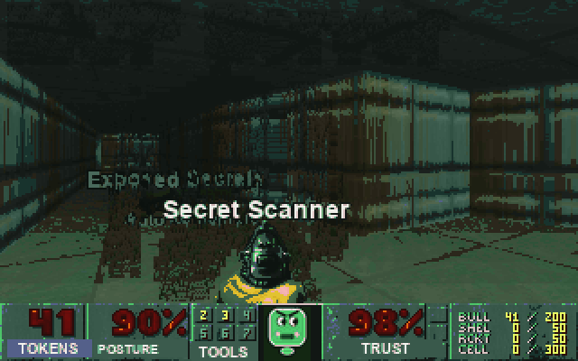
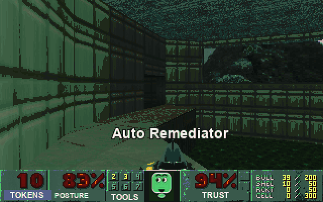
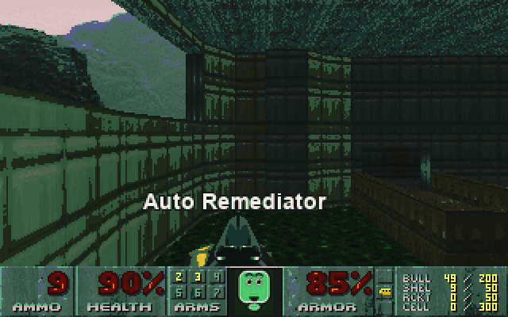
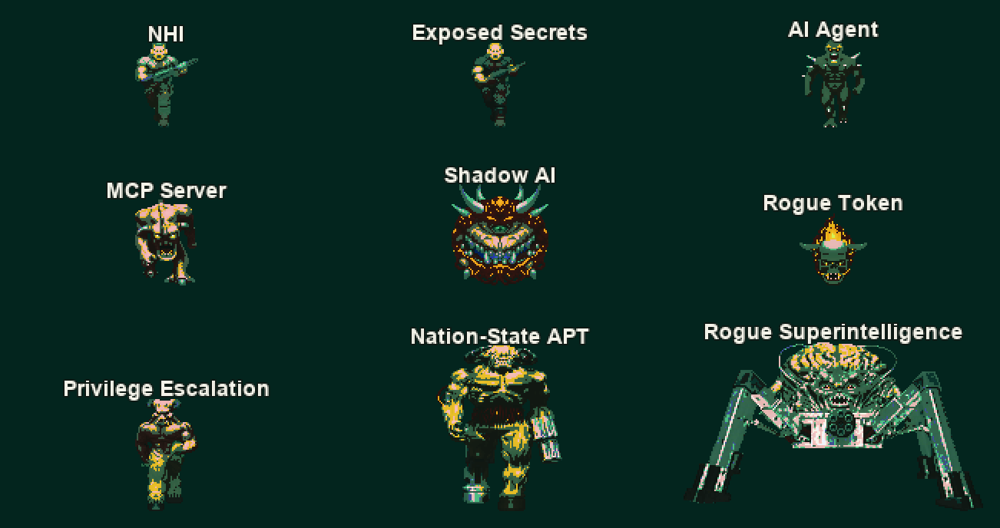
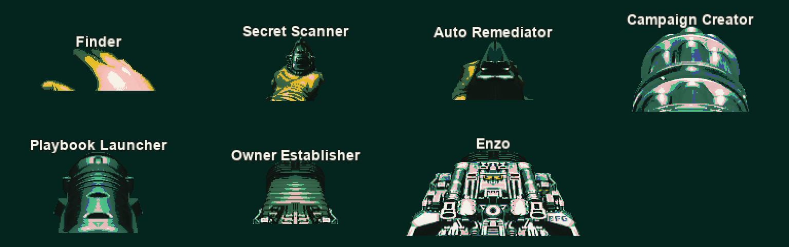
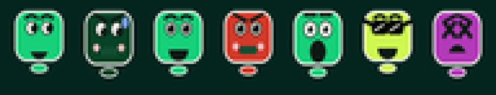
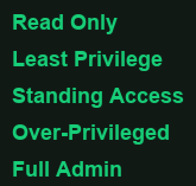

# Token DOOM

The risks Token hunts, turned into things you can shoot.

It's DOOM Episode 1, recolored Token green, with every monster renamed after a
threat we kill for real: non-human identities, exposed secrets, rogue AI agents,
shadow AI, privilege escalation. The weapons are Token capabilities. The player's
face is the Token logo, and it cracks as your health drops.

## Play it now

**[Play Token DOOM in your browser](https://guy455.github.io/token-doom/)**

No install, no download. Mouse aims, WASD moves, click fires, sound on. Runs in
any modern browser.

## Screenshots

## Enemies

The risks Token hunts, recolored and renamed. Their names float over their heads
in-game.

## Weapons

Token capabilities, labeled right on the gun.

## The face

The Token logo, animated: eyes glance around, it grins on a pickup, grimaces
while firing, and cracks as health drops.

## Difficulties

Access levels: more access, more danger.

## Prefer a native build? Download for desktop

Bring your own Doom: drop a `doom.wad` (from a full copy of Doom on Steam or GOG,
or the free [freedoom1.wad](https://freedoom.github.io)) into the folder, then run
the launcher.

- Windows → [token-doom-windows.zip](https://github.com/guy455/token-doom/releases/latest/download/token-doom-windows.zip) → add `doom.wad`, run `Play.bat`
- macOS (Apple Silicon + Intel) → [token-doom-macos.zip](https://github.com/guy455/token-doom/releases/latest/download/token-doom-macos.zip) → add `doom.wad`, run `Play.command`

Latest builds are on the [releases page](https://github.com/guy455/token-doom/releases/latest).

## Legal

GZDoom and PrBoom are GPL. The Token branding and generated art are Token's own.
The browser version runs on id Software's freely redistributable Doom shareware
(Episode 1). The desktop downloads ship no Doom game data; you supply your own.
